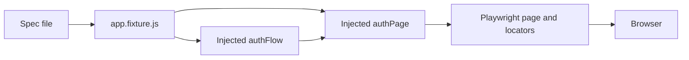
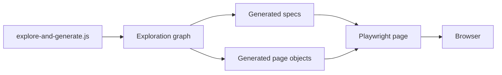

# Framework Navigation Guide

This guide explains how the framework actually runs, where to add new tests, and how to explain the self-healing behavior without overselling it.

## Why This Guide Exists

The repository has two different testing lanes:

- Hand-authored business-flow tests in [tests/flows](../tests/flows)
- AI-generated discovery tests in [tests/generated](../tests/generated)

If you mix those two lanes together mentally, the framework feels harder than it really is.

## The Fast Mental Model

For hand-authored tests, think in five layers:

1. Spec file defines the scenario and business assertions.
2. Fixture injects shared objects into the test.
3. Flow coordinates multi-step business actions.
4. Page object owns locators and page-level interactions.
5. Playwright drives the browser.

For generated tests, the flow is simpler:

1. Exploration script discovers pages and flows.
2. It writes generated page objects into [framework/pages/generated](../framework/pages/generated).
3. It writes generated specs into [tests/generated](../tests/generated).
4. Those generated specs run directly with Playwright.

## Path 1: Hand-Authored Flow Tests

Use this path when you want maintainable, explainable business automation.

Representative example:

- Spec: [tests/flows/auth/register-login-flow.spec.js](../tests/flows/auth/register-login-flow.spec.js)
- Fixture: [framework/fixtures/app.fixture.js](../framework/fixtures/app.fixture.js)
- Flow: [framework/flows/auth/AuthFlow.js](../framework/flows/auth/AuthFlow.js)
- Page object: [framework/pages/AuthPage.js](../framework/pages/AuthPage.js)
- Shared data: [framework/data/authAndCart.data.js](../framework/data/authAndCart.data.js)

### What Happens At Runtime

### Step-By-Step Walkthrough

1. The spec imports `test` and `expect` from [framework/fixtures/app.fixture.js](../framework/fixtures/app.fixture.js), not directly from Playwright.
2. That fixture creates and injects `authPage`, `productsPage`, `authFlow`, `cartFlow`, `checkoutFlow`, `ordersFlow`, and `scenarioData`.
3. The spec stays business-focused. In [tests/flows/auth/register-login-flow.spec.js](../tests/flows/auth/register-login-flow.spec.js), the test does not fill every field itself. It calls `authFlow.registerWithRetryThenLogin(...)`.
4. [framework/flows/auth/AuthFlow.js](../framework/flows/auth/AuthFlow.js) is the orchestration layer. It decides the order of actions, how retries work, and how registration/login are chained.
5. [framework/pages/AuthPage.js](../framework/pages/AuthPage.js) is the UI interaction layer. It contains selectors and page-specific methods like `open`, `goToRegister`, `registerUser`, and `login`.
6. The spec then performs the final business assertions, like verifying the dashboard/cart button and adding products with [framework/pages/ProductsPage.js](../framework/pages/ProductsPage.js).

### Responsibility Split

- Spec layer: business intent, tags, scenario coverage, final assertions.
- Fixture layer: dependency wiring.
- Flow layer: reusable business journeys across pages.
- Page object layer: selectors and screen-level actions.
- Data layer: stable default input values.

### Why This Split Is Good

- Specs stay readable for reviewers.
- Page objects stop locators from leaking everywhere.
- Flows prevent duplicated multi-step journeys.
- Fixtures make tests consistent and easier to scale.

### What To Avoid

- Do not put raw locators all over spec files unless the assertion is truly one-off.
- Do not put business rules inside page objects.
- Do not turn flows into giant god-classes that know every page in the system.

## Path 2: AI-Generated Discovery Tests

Use this lane when you want to scan an application and generate a first-pass suite quickly.

Representative example:

- Generation CLI: [framework/ai/scripts/explore-and-generate.js](../framework/ai/scripts/explore-and-generate.js)
- Generated spec: [tests/generated/login-flow.spec.js](../tests/generated/login-flow.spec.js)
- Generated page object: [framework/pages/generated/TotalConnect2LoginPage.js](../framework/pages/generated/TotalConnect2LoginPage.js)
- Centralized generated-test data: [framework/config/test-data.config.js](../framework/config/test-data.config.js)

### What Happens At Runtime

### The Important Difference

Generated specs usually instantiate page objects directly and use `@playwright/test` without the custom fixture layer.

That is why generated tests are faster to create, but usually less expressive than the hand-authored `tests/flows` lane.

## Self-Healing: What It Really Means In This Repo

There are two separate AI behaviors in the framework. They solve different problems.

## A. Runtime Locator Healing

Files involved:

- AI fixture: [framework/ai/fixtures/app.ai.fixture.js](../framework/ai/fixtures/app.ai.fixture.js)
- Page proxy: [framework/ai/core/page-proxy.js](../framework/ai/core/page-proxy.js)
- Locator proxy: [framework/ai/core/locator-proxy.js](../framework/ai/core/locator-proxy.js)
- Runtime graph: [framework/ai/graph/runtime-graph.js](../framework/ai/graph/runtime-graph.js)
- Healing node logic: [framework/ai/graph/nodes.js](../framework/ai/graph/nodes.js)
- Healer agent: [framework/ai/agents/locator-healer.agent.js](../framework/ai/agents/locator-healer.agent.js)

### Runtime Healing Flow

```mermaid
flowchart LR
    A[Test imports AI fixture] --> B[Fixture wraps page with createPageProxy]
    B --> C[Page object creates locator]
    C --> D[Locator proxy intercepts action failure]
    D --> E[Runtime healing graph]
    E --> F[Locator healer agent]
    F --> G[Trim DOM snapshot]
    G --> H[Model suggests alternatives]
    H --> I[Validate suggestions live]
    I --> J[Retry action with healed locator]
```

### Key Facts You Should Say Clearly

- Runtime healing is opt-in.
- It is only active for tests that import [framework/ai/fixtures/app.ai.fixture.js](../framework/ai/fixtures/app.ai.fixture.js).
- A search of the current `tests` tree shows no tests using that AI fixture yet.
- So the framework contains runtime healing capability, but it is not the default path for the current suite.

### Runtime Healing Logic

1. A test must use the AI fixture.
2. The fixture wraps the raw Playwright page with `createPageProxy(...)`.
3. That proxy intercepts locator-creation methods like `locator`, `getByRole`, and `getByText`.
4. Returned locators are wrapped again by `createLocatorProxy(...)`.
5. If a healable action like `click`, `fill`, or `waitFor` fails with a locator-like error, the runtime graph starts.
6. The runtime graph tries healing strategies in sequence: `css`, then `role`, then `text`.
7. The locator healer agent extracts a trimmed DOM snapshot, asks the model for alternative selectors, validates each suggestion against the live page, and retries the original action only if the suggestion resolves.
8. If all suggestions fail, the original Playwright error is thrown.

### Runtime Healing Tradeoffs

- Good: zero changes needed in downstream test code once the AI fixture is adopted.
- Good: healing is bounded to locator-like failures, not every possible error.
- Good: suggestions are validated on the live page before being accepted.
- Tradeoff: runtime healing adds latency when failures occur.
- Tradeoff: runtime healing can hide a UI drift symptom if you never review healing history.
- Tradeoff: if the test logic itself is wrong, runtime locator healing should not try to "fix" that.

## B. Post-Failure Analysis And Suggested Healing

Files involved:

- Reporter: [framework/ai/reporters/ai-healing-reporter.js](../framework/ai/reporters/ai-healing-reporter.js)
- Healing graph: [framework/ai/graph/healing-graph.js](../framework/ai/graph/healing-graph.js)
- Nodes: [framework/ai/graph/nodes.js](../framework/ai/graph/nodes.js)
- Failure analyzer: [framework/ai/agents/failure-analyzer.agent.js](../framework/ai/agents/failure-analyzer.agent.js)
- Test case healer: [framework/ai/agents/test-case-healer.agent.js](../framework/ai/agents/test-case-healer.agent.js)
- Outputs: [ai-reports](../ai-reports)

### What This Path Does

This is not runtime retrying. This is post-mortem reasoning after a test fails.

### Post-Failure Flow

1. The Playwright reporter captures a failed test.
2. It collects context such as error message, stack trace, steps, and screenshot path.
3. The healing graph classifies the failure.
4. If the category is a logic or assertion issue, it runs test-case healing analysis.
5. If the category is infrastructure-like, it records and reports instead of pretending it can heal the issue.
6. Results are written into [ai-reports](../ai-reports) and optionally injected into Allure output.

### Critical Design Choice

The post-failure path suggests changes. It does not silently rewrite your test code.

That is the right tradeoff for a demo or production-like environment because it keeps human control over actual source changes.

## How To Add A New Hand-Authored Test Without Getting Lost

Use this order every time:

1. Decide the domain folder using [docs/FLOW_BIFURCATION_MAP.md](./FLOW_BIFURCATION_MAP.md).
2. Add the spec under [tests/flows](../tests/flows).
3. Start from the fixture import pattern in [tests/flows/auth/register-login-flow.spec.js](../tests/flows/auth/register-login-flow.spec.js).
4. Reuse an existing flow if the journey already exists.
5. Add or extend a flow only when the scenario spans multiple page actions.
6. Add or extend a page object only when a screen interaction or locator is missing.
7. Keep final business assertions in the spec.

## The Simplest Rule For Deciding Where Code Belongs

- If it is a locator or screen interaction, it belongs in a page object.
- If it is a reusable multi-step business journey, it belongs in a flow.
- If it is test intent, tags, and scenario verification, it belongs in a spec.
- If it is cross-test setup or object wiring, it belongs in a fixture.

## A Practical Example

If tomorrow you add "user updates profile and sees success message":

- Create the spec in the right domain under [tests/flows](../tests/flows).
- Reuse the fixture import.
- If profile actions span open profile, edit form, save, and re-open verification, create `ProfileFlow`.
- If profile selectors do not exist, create or extend a `ProfilePage`.
- Keep the final business assertion in the spec: success message shown, values persisted, or redirect completed.

## Why Some Existing Tests Feel Hard To Explain

The repo has a mix of styles.

- The `tests/flows` lane is structured and explainable.
- Some tests, like [tests/flows/auth/register.spec.js](../tests/flows/auth/register.spec.js), still use direct page locators for certain validations. That is acceptable for one-off assertions, but it is noisier.
- The `tests/generated` lane is intentionally fast and mechanical, but not as polished for long-term maintenance.

If you are presenting this framework, position the generated lane as bootstrap automation and the hand-authored lane as maintainable production-style automation.

## The Honest Manager Talk Track

If a manager asks, "How does this framework work?", this is the clean answer:

1. "The spec expresses the business scenario."
2. "The fixture injects reusable flows and page objects."
3. "The flow layer orchestrates reusable business journeys like register-then-login."
4. "The page object layer holds selectors and page-specific interactions."
5. "Playwright executes the browser actions and assertions."
6. "The AI layer is additive. It can analyze failures and, when explicitly enabled through the AI fixture, attempt bounded locator healing."
7. "We do not let AI silently rewrite the source under the hood during normal execution. Reports and suggestions remain reviewable."

## The Honest Lead-Engineer Talk Track

If a senior asks, "What are the main tradeoffs?", answer this way:

1. "We trade a little abstraction for maintainability by separating specs, flows, fixtures, and page objects."
2. "We keep generated tests separate from curated flow tests because discovery speed and long-term maintainability are different goals."
3. "Runtime healing is intentionally limited to locator-like failures so it does not blur into test-logic mutation."
4. "Post-failure healing produces suggestions and reports instead of auto-editing source because governance matters more than novelty."
5. "The framework is strongest when AI assists diagnosis and recovery, not when AI replaces test design discipline."

## What To Say In An Azure Demo

Keep the story operational, not mystical:

1. "The application runs in the target environment."
2. "Playwright runs the suite and collects screenshots, traces, and reports."
3. "Our framework layers business flows over page objects for maintainability."
4. "If AI analysis is enabled, failed runs generate additional classification, healing, audit, and evidence artifacts."
5. "That gives the team faster triage and a credible self-healing demonstration without hiding what changed."

## Navigation Shortcuts

When you need to explain the project quickly, start from these files in this order:

1. [tests/flows/auth/register-login-flow.spec.js](../tests/flows/auth/register-login-flow.spec.js)
2. [framework/fixtures/app.fixture.js](../framework/fixtures/app.fixture.js)
3. [framework/flows/auth/AuthFlow.js](../framework/flows/auth/AuthFlow.js)
4. [framework/pages/AuthPage.js](../framework/pages/AuthPage.js)
5. [framework/pages/ProductsPage.js](../framework/pages/ProductsPage.js)
6. [playwright.config.js](../playwright.config.js)
7. [framework/ai/reporters/ai-healing-reporter.js](../framework/ai/reporters/ai-healing-reporter.js)
8. [framework/ai/core/page-proxy.js](../framework/ai/core/page-proxy.js)
9. [framework/ai/core/locator-proxy.js](../framework/ai/core/locator-proxy.js)
10. [framework/ai/agents/locator-healer.agent.js](../framework/ai/agents/locator-healer.agent.js)

If you can narrate those ten files cleanly, you can explain the framework to most reviewers.