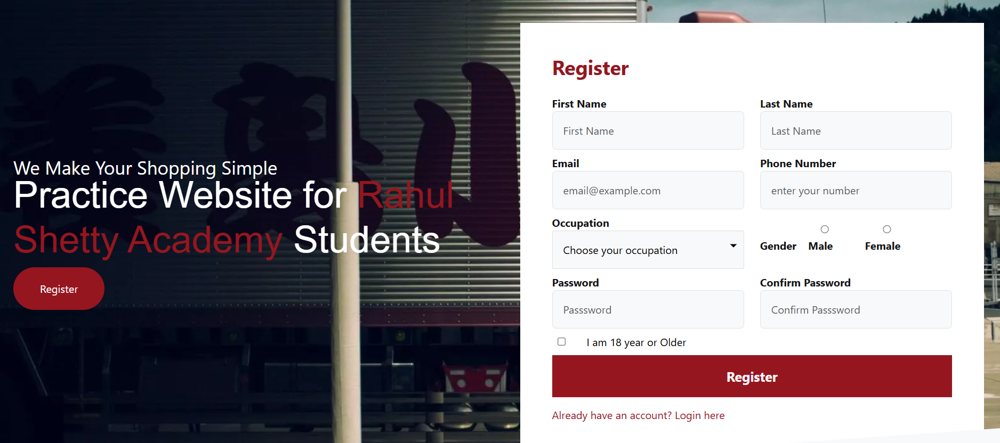

# User Flow Request (Lean Template)

Use this short template to describe business intent quickly.
Goal: minimum QA effort, maximum automation clarity.

## A. Flow Card (mandatory)
- Flow Name:
- Domain: `auth | cart | checkout | orders | profile | admin | other`
- Business Outcome (1-2 lines):
- Priority: `P0 | P1 | P2`

## B. Journey (mandatory)
Describe only core user behavior.

1. 
2. 
3. 
4. 

Success expected:
- URL/text/state:

## C. Test Intent (mandatory)
- Positive cases needed: 
- Negative cases needed: 
- Critical validations to assert (max 5):
1. 
2. 
3. 
4. 
5. 

## D. Data and Rules (mandatory)
- Base URL:
- Test user/data:
- Special rules (example: if account exists, retry with unique email):

Optional JSON:

```json
{
  "loginData": {
    "email": "",
    "password": ""
  },
  "flowData": {}
}
```

## E. Evidence Needed (mandatory)
- Run headed: `yes | no`
- Need terminal summary: `yes | no`
- Need HTML report summary: `yes | no`

## Screenshots (optional)

```md
### Screen 1

Notes:
```

---

## What I will produce from this
1. Test specs under `tests/flows/<domain>/`.
2. Reusable page methods in `framework/pages/`.
3. Data updates in `framework/data/` when needed.
4. Executed suite with step-level logs and assertion summary.

## Notes
- If any mandatory section is missing, I will assume safe defaults and proceed.
- Bifurcation is domain-first: each new scenario goes to its domain folder under `tests/flows/`.

---

## Example Requests (Use This Standard)

### Flow Request: FLOW-001
## A. Flow Card (mandatory)
- Flow Name: Register with retry and login
- Domain: `auth`
- Business Outcome (1-2 lines): User should be able to register. If account already exists, retry with unique email and login successfully.
- Priority: `P0`

## B. Journey (mandatory)
1. Open login page.
2. Go to register page and submit user details.
3. If duplicate account message appears, retry registration with a unique email.
4. Login with the final created credentials.

Success expected:
- URL/text/state: user lands on dashboard and cart button is visible.

## C. Test Intent (mandatory)
- Positive cases needed: 1
- Negative cases needed: 1
- Critical validations to assert (max 5):
1. Registration succeeds or duplicate message appears.
2. Duplicate account error text is visible when account already exists.
3. Retry registration succeeds with unique email.
4. Login succeeds with created credentials.
5. Dashboard/cart button visible after login.

## D. Data and Rules (mandatory)
- Base URL: `https://rahulshettyacademy.com/client/`
- Test user/data: Use `framework/data/authAndCart.data.js` register/login data.
- Special rules (example: if account exists, retry with unique email): Retry with unique email generated at runtime.

Optional JSON:

```json
{
  "loginData": {
    "email": "keshavnaganathan@gmail.com",
    "password": "Kesh@1234"
  },
  "flowData": {
    "retryOnDuplicate": true
  }
}
```

## E. Evidence Needed (mandatory)
- Run headed: `yes`
- Need terminal summary: `yes`
- Need HTML report summary: `yes`

Implemented in:
- `tests/flows/auth/register-login-flow.spec.js`

---

### Flow Request: FLOW-002
## A. Flow Card (mandatory)
- Flow Name: Login and add item to cart dynamically
- Domain: `cart`
- Business Outcome (1-2 lines): User logs in and adds a runtime-selected item to cart, then validates cart badge and cart contents.
- Priority: `P0`

## B. Journey (mandatory)
1. Login with valid credentials.
2. Resolve target product from runtime input (name/text/attribute/candidates).
3. Add product to cart from product card.
4. Verify cart badge and cart item presence.

Success expected:
- URL/text/state: cart page opens and selected product is visible in cart.

## C. Test Intent (mandatory)
- Positive cases needed: 1
- Negative cases needed: 0
- Critical validations to assert (max 5):
1. Login reaches dashboard.
2. Target product card is found dynamically.
3. Add to cart success toast appears.
4. Cart badge count is updated.
5. Cart page shows selected item.

## D. Data and Rules (mandatory)
- Base URL: `https://rahulshettyacademy.com/client/`
- Test user/data: Use `framework/data/authAndCart.data.js` login data.
- Special rules (example: if account exists, retry with unique email): Product can be passed at runtime.

Optional JSON:

```json
{
  "loginData": {
    "email": "keshavnaganathan@gmail.com",
    "password": "Kesh@1234"
  },
  "flowData": {
    "runtimeProduct": true
  }
}
```

## E. Evidence Needed (mandatory)
- Run headed: `yes`
- Need terminal summary: `yes`
- Need HTML report summary: `yes`

Implemented in:
- `tests/flows/cart/add-zara-coat.spec.js`

---

## Starter Block For New Requests (Copy-Paste)

```md
### Flow Request: FLOW-Order and Checkout
## A. Flow Card (mandatory)
- Flow Name: verify orders and checkout
- Domain: `checkout | orders |`
- Business Outcome (1-2 lines): User navigates to the carts page, validates the item details added is same as item selected and checkout product added, verifies product details after checkout
- Priority: `P1`

## B. Journey (mandatory)
1.User adds product to cart
2.User validates allproduct details properly visible of the item added
3. User clicks on checkout and enters card details and submits for payment
4. User verifies In orders Page, that his checked out item details are shown and validates it

Success expected:
- URL/text/state: the items should be added to cart and checked out items should be 
 seen in the orders page with all their details neatly listed 

## C. Test Intent (mandatory)
- Positive cases needed:
- Negative cases needed:
- Critical validations to assert (max 5):
1. validate all item details are same as those seen in orders page
2. validate that when user clicks on either Buy Now or Checkout directed to payment method page
3.Validate that all fields can be added and Place Order
4. add wrong values and see if order should not be allowed to be placed with an error "Please Enter full shipping Information"
5. without entering coupon ID, click on Apply Coupon and validate error "Apply Coupon"

## D. Data and Rules (mandatory)
- Base URL: `https://rahulshettyacademy.com/client/`
- Test user/data:
- Special rules:

## E. Evidence Needed (mandatory)
- Run headed: `yes`
- Need terminal summary: `yes`
- Need HTML report summary: `yes`
```
